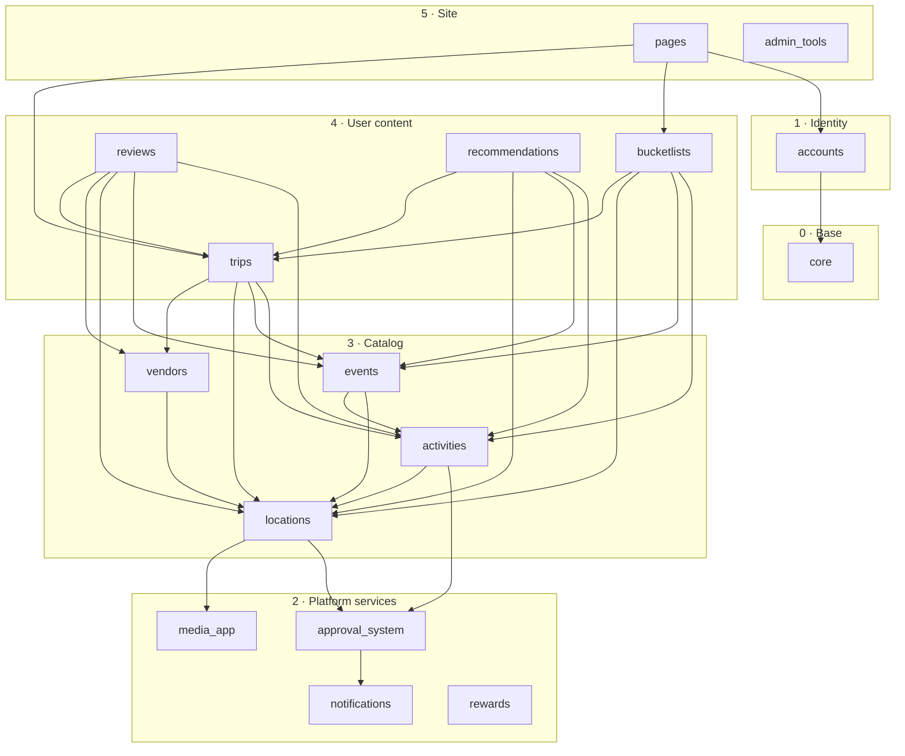

# App dependencies

**An arrow `A --> B` means "A imports B".** Imports may only point down the layers (or along
the allowed same-layer arrows). The rules are the "Dependency layers" table in `CLAUDE.md`.
`scripts/check_layers.py` enforces them, and `apps.core.tests.test_layers` runs it as part of
`manage.py test`.

The diagram shows the imports that actually exist (generated from the checker's import scan,
migrations excluded). Every app also imports `core`; those arrows are left out to keep the
diagram readable.

Foreign keys to the user model go through `settings.AUTH_USER_MODEL`, so they create a
migration dependency on `accounts` but no import. That is why most apps show no arrow to
`accounts`. For which side of each relationship owns the foreign key, see `fk_direction.md`.
